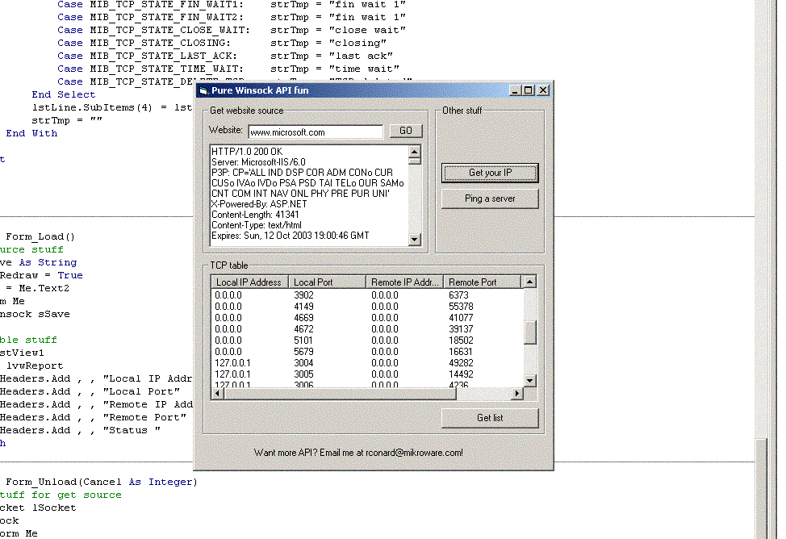



## Pure Winsock API examples

### Description

This is just a small app that shows you some pure winsock api examples. Some people would say it's easier to just put the winsock control on your form, and it is. But, I think everyone should know a little hardcore winsock api. Enjoy!
 
### More Info
 

             |
---                |---
**Submitted On**   |2003-10-12 14:57:28
**By**             |[Conard Data Systems](https://github.com/Planet-Source-Code/PSCIndex/blob/master/ByAuthor/conard-data-systems.md)
**Level**          |Intermediate
**User Rating**    |5.0 (10 globes from 2 users)
**Compatibility**  |VB 6\.0
**Category**       |[Internet/ HTML](https://github.com/Planet-Source-Code/PSCIndex/blob/master/ByCategory/internet-html__1-34.md)
**World**          |[Visual Basic](https://github.com/Planet-Source-Code/PSCIndex/blob/master/ByWorld/visual-basic.md)
**Archive File**   |[Pure\_Winso16575310122003\.zip](https://github.com/Planet-Source-Code/conard-data-systems-pure-winsock-api-examples__1-49188/archive/master.zip)

